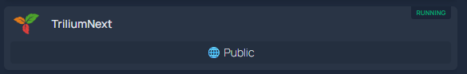

# Homepage Exposure Status

[](LICENSE)
[](https://github.com/petebojovic/homepage-exposure-status/pkgs/container/homepage-exposure-status)

Shows whether your self-hosted services are actually reachable from the public internet, right on your [Homepage](https://gethomepage.dev) dashboard.



## Quick start

```yaml
# docker-compose.yaml
services:
  homepage-exposure-status:
    image: ghcr.io/petebojovic/homepage-exposure-status:latest
    container_name: homepage-exposure-status
    ports:
      - "${PORT:-8000}:8000"
    environment:
      - ENABLED_CHECKS=check_host
      - LOG_LEVEL=INFO
    restart: unless-stopped
    cap_drop:
      - ALL
    security_opt:
      - no-new-privileges:true
    mem_limit: 256m
    cpus: 0.50
```

```bash
docker compose up -d
```

Test it (swap `8000` for whatever you set `PORT` to, if you changed it):

```bash
curl "http://localhost:8000/check?url=example.com"
```

## Adding it to Homepage

If your service is auto-discovered from Docker labels, add these to its own container (alongside its existing `homepage.*` labels), using its own hostname. Replace `your-server` with whatever address reaches this container from wherever Homepage runs, usually your Docker host's hostname or LAN IP. If Homepage and this container happen to share a custom Docker network, the container name works too:

```yaml
labels:
  - homepage.widget.type=customapi
  - homepage.widget.url=http://your-server:8000/check?url=your-service.example.com
  - homepage.widget.refreshInterval=3600000 # 1 hour, in milliseconds (see note below)
  - homepage.widget.mappings[0].label=Exposure
  - homepage.widget.mappings[0].field=check_host
  - homepage.widget.mappings[0].remap[0].value=true
  - homepage.widget.mappings[0].remap[0].to=🌐 Public
  - homepage.widget.mappings[0].remap[1].value=false
  - homepage.widget.mappings[0].remap[1].to=🔒 Private
```

Or, for a service defined manually in `services.yaml`:

```yaml
- YourService:
    href: https://your-service.example.com
    widget:
      type: customapi
      url: http://your-server:8000/check?url=your-service.example.com
      refreshInterval: 3600000 # 1 hour, in milliseconds (see note below)
      mappings:
        - field: check_host
          label: Exposure
          remap:
            - value: "true"
              to: "🌐 Public"
            - value: "false"
              to: "🔒 Private"
```

Each service card checks its own hostname independently. `remap` (with an emoji) is the closest thing to a status indicator Homepage's Custom API widget supports, no icons or colors available.

Homepage refetches every 10 seconds by default. Set `refreshInterval` (ms) higher, an hour or more is plenty since exposure status doesn't change minute to minute.

### Optional: caching

Set `CACHE_TTL_SECONDS` to cache each hostname's result and reduce check-host.net traffic, useful with many services or several viewers. Off by default; only helps if set longer than `refreshInterval`.

```yaml
environment:
  - CACHE_TTL_SECONDS=14400 # 4 hours
```

Force a fresh check without waiting for the cache to expire:

```bash
curl -X DELETE "http://localhost:8000/cache?url=your-service.example.com"
```

Omit `url` to clear everything.

## Configuration

| Option | Type | Default | Description |
| :--- | :--- | :--- | :--- |
| `PORT` | int | `8000` | Host-side port. A `docker compose` variable, not read by the app itself, set it in a `.env` file next to `docker-compose.yaml` (or export it in your shell) if `8000` is already taken |
| `ENABLED_CHECKS` | string | `check_host` | Comma-separated list of checkers to run, e.g. `check_host,cloudflare` |
| `CACHE_TTL_SECONDS` | int | `0` | How long each hostname's result is cached before re-checking. `0` disables caching (default) |
| `LOG_LEVEL` | string | `INFO` | Python logging level, e.g. `DEBUG` for full HTTP request/response tracing |
| `CHECK_HOST_MAX_NODES` | int | `3` | Number of check-host.net nodes checked per request |

## Roadmap

Ideas for future checkers and features, not yet built. Weigh in on [GitHub Discussions](https://github.com/petebojovic/homepage-exposure-status/discussions) if any of these matter to you:

- **Cloudflare Tunnel checker**: confirms a tunnel route actually exists, via Cloudflare's own API.
- **Traefik checker**: confirms a router is actually configured, via Traefik's own API.
- **UniFi checker**: confirms a port-forward/firewall rule actually exists, via UniFi's own API.
- **Aggregate "all services" card**: one Homepage card listing every configured host's status at a glance, instead of one card per service.

## Why this exists

Homepage has no way to show whether a service on your dashboard is actually reachable from the internet, or just from your LAN. This checks the real answer using [check-host.net](https://check-host.net)'s free API (no signup needed), instead of a label you'd have to remember to keep updated yourself.

## Security & privacy

Please read this before using it.

- **This service has no authentication or rate limiting. Do not expose it to the public internet.** Run it on your own LAN, the same way Homepage itself runs.
- Every check is relayed through check-host.net, a free third-party service. Based on their API's `permanent_link` response field, they appear to retain a permanent record of every check performed. Don't check hostnames you don't want a third party to have a lasting record of monitoring.
- Results depend on external network conditions and a limited sample of nodes, they're not infallible. For anything security-sensitive, verify through another method too.
- See [SECURITY.md](SECURITY.md) for the vulnerability disclosure policy.

## How it works

1. Kicks off a check via check-host.net's API for the hostname you give it.
2. Polls for results from independent external nodes, retrying while checks are still in progress.
3. Returns `true` if any node reached the host at all (even an error response proves reachability), `false` if none could reach it.

## License

[MIT](LICENSE)
